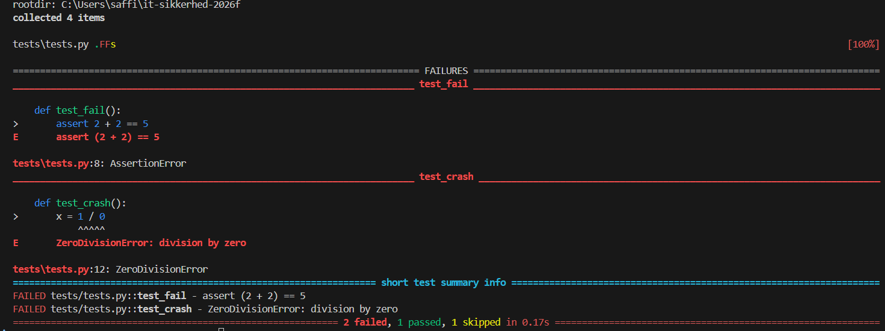

# it-sikkerhed-2026f

Teststrategier – Login (IT-sikkerhed)
Emne

Login til et website (brugernavn og adgangskode)

Ækvivalensklasser

Korrekt brugernavn og korrekt adgangskode → login godkendt

Forkert brugernavn → login afvist

Forkert adgangskode → login afvist

Grænseværditest

Regel: Adgangskode skal være mellem 8 og 12 tegn.

7 tegn (for kort) → fejl

8 tegn (mindste gyldige) → OK

12 tegn (største gyldige) → OK

13 tegn (for langt) → fejl

CRUD(L)

Create: Opret ny bruger

Read: Se brugerprofil

Update: Skift adgangskode

Delete: Slet bruger

List: Vis alle brugere (admin)

Cycle Process Test

Bruger åbner login-side

Bruger indtaster brugernavn og adgangskode

System validerer oplysninger

Login gennemføres eller fejl vises

Bruger logger ind eller prøver igen

Testpyramiden

Unit test: Tjek længde på adgangskode

Integration test: Tjek login-API mod database

UI test: Tjek login-knap og fejlbesked i browser

Decision Table Test

Korrekt brugernavn + korrekt adgangskode → login OK

Korrekt brugernavn + forkert adgangskode → fejl

Forkert brugernavn + korrekt adgangskode → fejl

Forkert brugernavn + forkert adgangskode → fejl

Security Gate

Under udvikling: Unit test og grænseværditest

Før deployment: Integration test og decision table test

Før release: UI test og cycle process test

## Testresultater af unittest

### Bestået test
### Fejlet test
### Skippet test

